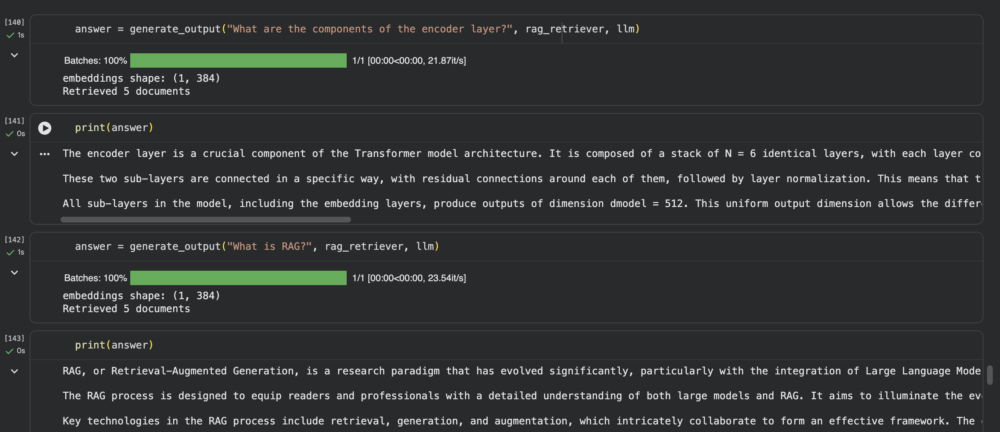

# 📚 RAG-Based PDF Question Answering System

A Retrieval-Augmented Generation (RAG) based question-answering system that allows users to ask questions from multiple PDF documents. The system uses semantic search to retrieve relevant document content and generates context-aware answers using the Groq LLM API.

Built using **LangChain, ChromaDB, Sentence Transformers, PyPDF, and Groq API**.

---

## 🚀 Features

- Load and process multiple PDF documents
- Extract text from PDF files
- Split documents into meaningful chunks
- Generate vector embeddings using Sentence Transformers
- Store embeddings in ChromaDB vector database
- Retrieve relevant document chunks using semantic search
- Generate accurate answers using Groq LLM
- Support multi-document question answering

---

## 🏗️ RAG Architecture

```
PDF Documents
      │
      ▼
Document Loading
      │
      ▼
Text Chunking
      │
      ▼
Embedding Generation
(Sentence Transformer)
      │
      ▼
Vector Database
(ChromaDB)
      │
      ▼
Retriever
      │
      ▼
Groq LLM
      │
      ▼
Generated Answer
      │
      ▼
Testing & Evaluation
```

---

## 🛠️ Technologies Used

| Technology | Purpose |
|------------|---------|
| Python | Programming language |
| LangChain | RAG pipeline framework |
| ChromaDB | Vector database |
| Sentence Transformers | Text embedding generation |
| Groq API | Large Language Model inference |
| PyPDF | PDF text extraction |

---

## ⚙️ Installation

### Clone the repository

```bash
git clone https://github.com/shubhahire9/RAG-Based-PDF-Question-Answering.git

cd RAG-Based-PDF-Question-Answering
```

### Install dependencies

```bash
pip install -r requirements.txt
```

---

## 📂 Project Structure

```
RAG-Based-PDF-Question-Answering/
│
├── data/
│ ├── attention.pdf
│ └── Research.pdf
│
├── RAG_Pipeline.ipynb
|── output.png
└── README.md
```

---

## 📸 Demo



---

## 🔄 Workflow Explanation

1. **Document Loading**
   - Reads PDF documents and extracts text.

2. **Text Chunking**
   - Splits large documents into smaller chunks for efficient retrieval.

3. **Embedding Generation**
   - Converts text chunks into vector embeddings using Sentence Transformers.

4. **Vector Storage**
   - Stores embeddings and document information in ChromaDB.

5. **Retrieval**
   - Finds the most relevant document chunks based on user queries.

6. **Generation**
   - Sends retrieved context to Groq LLM to generate answers.

7. **Testing**
   - Evaluates retrieval accuracy and answer quality.

---

## 🔮 Future Improvements

- Support DOCX and TXT files
- Build a Streamlit web application
- Implement hybrid search (keyword + vector search)
- Add conversation memory
- Add document metadata filtering
- Deploy as a cloud application

---
